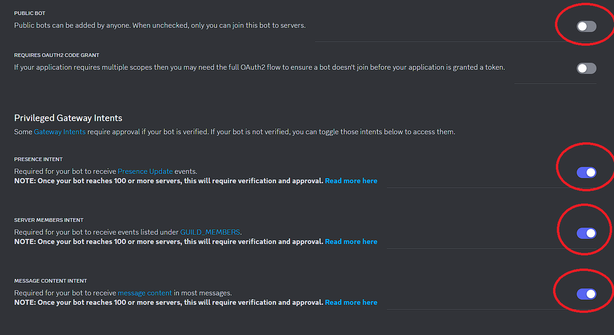

# Discord Bot Active Developer Badge 

## Requirements

### Python

First, you need to have Python installed, version 3 or higher. If you don't have it, simply install it through [Python installation page](https://www.python.org/downloads/)


### Discord.py
Then install discord.py which is required for running your bot :

```
pip install discord-py
```

## Creating a bot 

1) First go to [Discord Developer Portal](https://discord.com/developers/applications)
2) Then click on "Create an application" on the top right corner
3)  Go to OAuth2
4) Check `bot` and `applications.commands`
5) Scroll to `BOT PERMISSIONS`
6) Check `Administrator`
7) Copy the generated URL and paste it on your browser
8) Add the bot to your server. RECOMMENDED : you can create a new server for it, and make it a Community server (which will be required to claim the badge)
9) Go back to Discord Developer Portal, and go to `Bot`
10) Uncheck `PUBLIC BOT` and check all Intents (`PRESENCE INTENT`, `SERVER MEMBERS INTENT` `MESSAGE CONTENT INTENT`)

11) Press `Reset Token` button and copy your bot token (⚠️ do **NOT** share it with anyone)
12) Finally go to `bot.py` file and paste it inside the parenthesis of `bot.run("YOUR TOKEN")`

### Claim badge
After using the /hello command, you'll have to wait at least 24 hours to be able to claim your badge at [Active Developer Badge](https://discord.com/developers/active-developer).

> [!IMPORTANT]
> The /hello command may not be available immediately after starting the bot. It could take up to an hour to become accessible.
